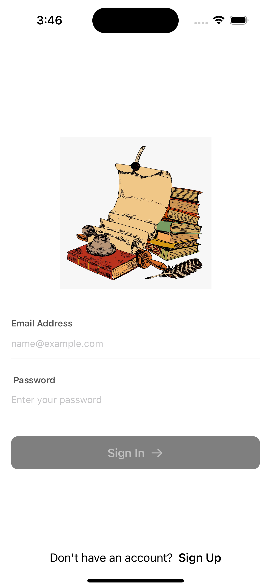
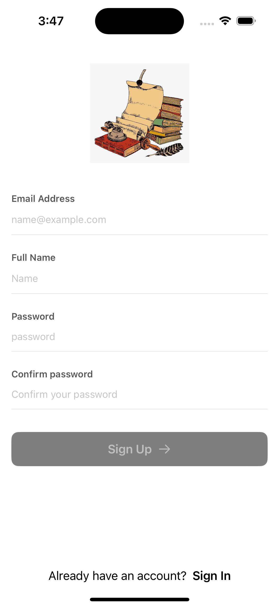
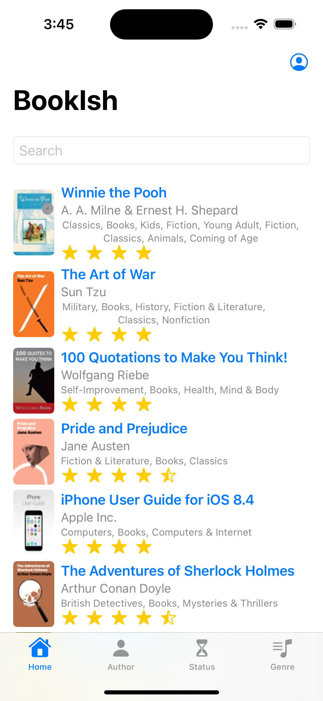
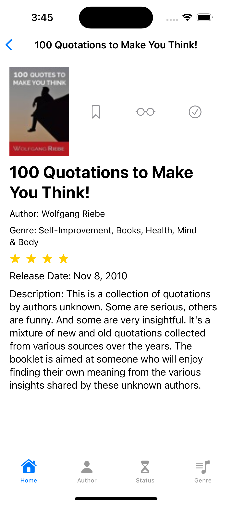
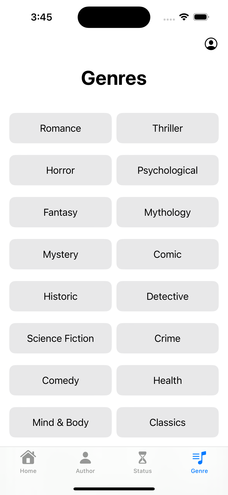
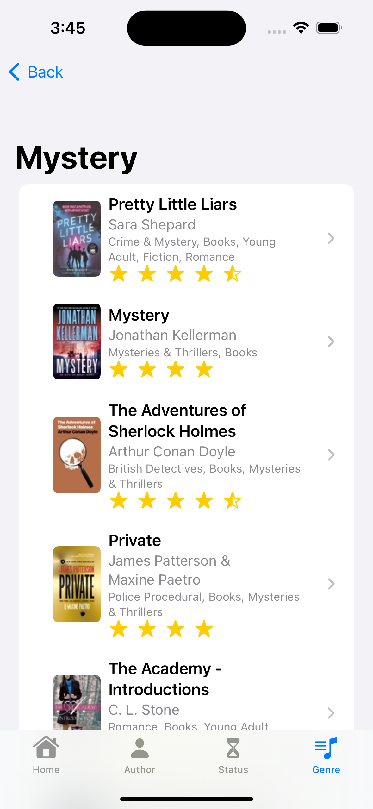
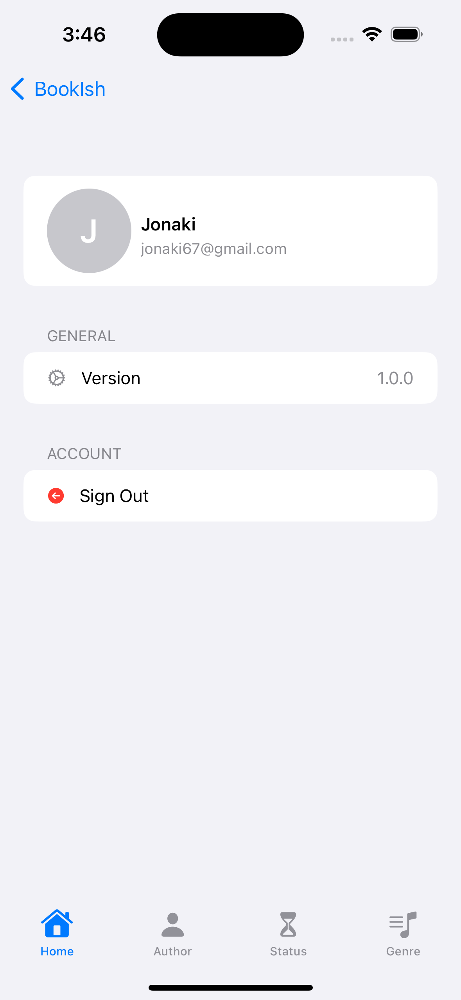

# BookIsh – An iOS Book Tracking App

BookIsh is an iOS application that serves as a digital diary for book lovers. Users can keep track of books they have read, are currently reading, or plan to read in the future. The app also allows users to discover new books via the iTunes API based on their favorite authors or genres.

## Features

- Email authentication via Firebase
- User registration and login system
- Book search powered by the iTunes API
- View detailed book information (title, author, rating, genre, description, etc.)
- Manage reading status:
  - Wishlist
  - Currently Reading
  - Have Read
- Browse books by author or genre
- Real-time database updates using Firebase

## Technologies Used

- Swift & SwiftUI for frontend development
- Firebase for user authentication and data storage
- iTunes Search API for fetching book data
- Combine framework for asynchronous data handling

## Project Structure

- `Book.swift`: Defines the data model for book objects.
- `BookFetcher.swift`: Handles API calls to fetch book lists and search results.
- `AuthorBookFetcher.swift`: Searches for books by a specific author.
- `CurrentReadViewModel.swift`, `WishListViewModel.swift`, `HaveReadViewModel.swift`: Manage reading lists from Firebase.

## Team Members

- Nusrat Jahan Jonaki (Roll: 1907067)
- Nishat Tasnim Mahi (Roll: 1907072)
- Sumiya Islam Barsha (Roll: 1907076)
- Samin Saiara (Roll: 1907078)
- Anisa Walida (Roll: 1907087)

### Contribution Highlights

- **Samin Saiara**:
  - Implemented user registration with Firebase
  - Integrated iTunes API to fetch and display book data
  - Contributed on the genre feature implementation

## Screenshots

<table>
  <tr>
    <td>Login</td>
    <td>Register</td>
    <td>Homepage</td>
  </tr>
  <tr>
    <td></td>
    <td></td>
    <td></td>
  </tr>
  <tr>
    <td>Search</td>
    <td>Book Details</td>
    <td>Wishlist</td>
  </tr>
  <tr>
    <td></td>
    <td></td>
    <td></td>
  </tr>
  <tr>
    <td>Genre Page</td>
    <td>Genre Results</td>
    <td>User Profile</td>
  </tr>
  <tr>
    <td></td>
    <td></td>
    <td></td>
  </tr>
</table>

